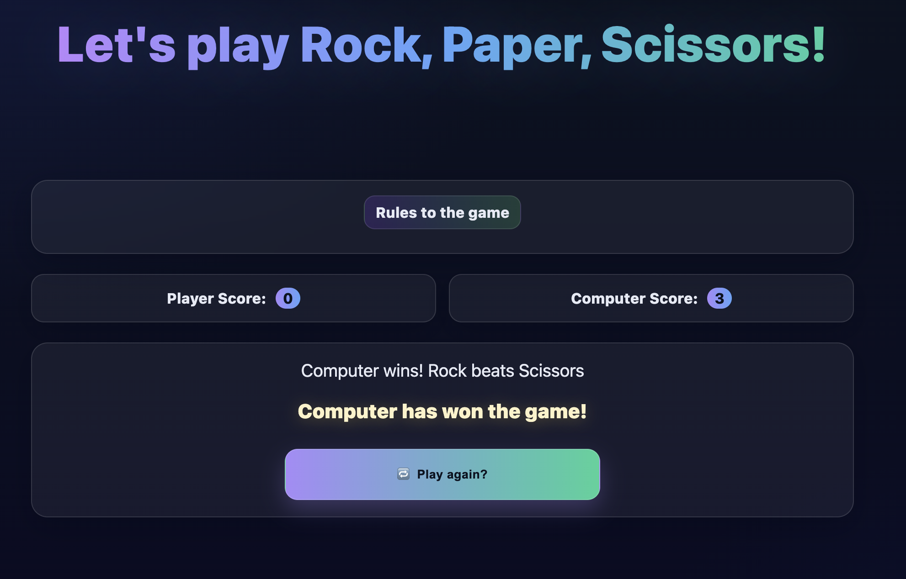

# ​ Rock • Paper • Scissors

A stylish, responsive, and interactive version of the classic **Rock, Paper, Scissors** game.  
Built with **HTML, CSS, and JavaScript**, this project lets you battle against the computer until one side reaches **3 points** 🏆.  

---

##  Preview

A quick snapshot of the game in action:



---

##  Features
- 🕹️ **Play vs Computer** — random computer choice each round  
- 📊 **Dynamic Scoreboard** — first to 3 wins  
- 📱 **Responsive Design** — works well on any screen  
- 🎨 **Modern UI/UX** — gradient buttons, icons, animations  
- 🔄 **Reset Button** — restart immediately  

---

##  Game Rules
- **Rock** 🪨 beats **Scissors** ✂️  
- **Scissors** beat **Paper** 📄  
- **Paper** beats **Rock**  
- Same pick → it's a tie 🤝  

First to score **3 points** wins!

---

##  Live Demo  
🔗 [Play the Game Here](http://127.0.0.1:5500/Rock_Paper_Scissor/index.html)

---

##  Tech Stack
- **HTML5** — structure & semantics  
- **CSS3** — styling, animations, responsiveness  
- **JavaScript (ES6)** — game logic & interactivity  

---

##  Project Structure
```bash
rock-paper-scissors/
├── Images/              # Folder for project assets
│   └── Website.png      # Demo screenshot
├── index.html           # Main HTML file
├── styles.css           # Styling (modern, responsive, animated)
├── script.js            # Game logic
└── README.md            # Project documentation
